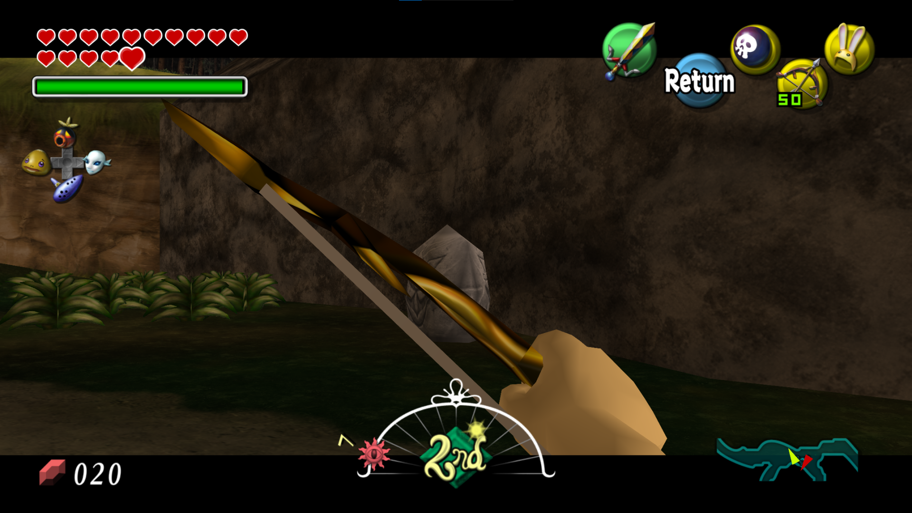

# Majora's Mask: No Letterboxxing Mod

This a mod for Zelda64Recomp that does exactly what it says on the tin. It disables all instances of letterboxing in the game, such as when aiming or in target lock-on.

## Screenshots

Aiming without this mod:

Aiming with this mod:

Cutscenes without this mod:

Cutscenes with this mod:

### Building

If you have Python, simply running the `build_mod.py` script should take care of everything.

If not, you can follow the instructions below:

* First, you need to build the [N64Recomp](https://github.com/N64Recomp/N64Recomp) library (included) for the `RecompModTool` utility.
* Second, run `make` (with an optional job count) to build the mod code itself.
* Third, run the `RecompModTool` utility with `mod.toml` as the first argument and the build dir (`build` in the case of this template) as the second argument.
* This will produce your mod's `.nrm` file in the build folder.
